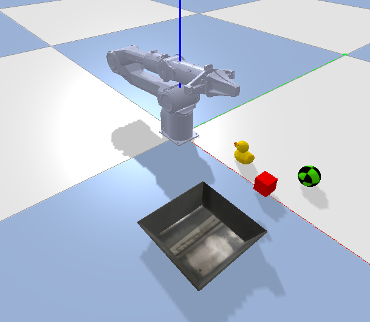

# General Bionix Grasping Example

This repository demonstrates a pipeline for predicting and executing robot grasps using a PyBullet simulation environment and the General Bionix API for point cloud processing and grasp planning.




## Running SO100 Point -> Pick + Place

### Prerequisistes: 
- SO100 Robot Arm
- Depth camera (we provide code for RealSense in this repo but feel free to adapt)
- Connect both to your PC

### Instructions:

1. **_Install Requirements_**: 
- gb_examples requirements:
```bash
conda create -n grasp_example python=3.10
conda activate grasp_example
pip install -r requirements.txt
```
- Install Lerobot. Please refer to lerobot documentation for additional information: https://huggingface.co/docs/lerobot/en/installation
- In a seperate directory to this repo:
```bash
git clone https://github.com/huggingface/lerobot.git
cd lerobot
```
- If using miniconda:
```bash
conda install ffmpeg -c conda-forge
```
```bash
pip install -e .
pip install -e ".[feetech]"
```

2. **_Calibration_**: Refer to the comments at the top of calibration.py for instructions. 
- It's recommended to get ~0.01m error for good accuracy.
- Note that if the robot base or camera moves, recalibration is required.
3. **_Run Meshcat_**: In a seperate terminal for visualizing the pointcloud and grasp predictions.
```bash
meshcat-server
```
4. **_Fill in the User TODOs at top of grasp_example.py_**
5. **_Run grasp_example_so100.py_**: 
```bash
python3 grasp_example_so100.py
```
6. **_Pick + Place_**: 
- Click on an object in the image window to pick and close the window.
- Wait for the API to return a grasp prediction. You will see the prediction in the pybullet sim and have the option to execute on the real robot.
- Click on a location on the image window to place and close the window.


## Tips On Getting Good Grasps
- Realsense position matters. If you are getting HTTP 400 errors from the grasp prediction service, the pointcloud is likely too small/ from a bad angle. Try moving the realsense camera close/ at an isometric view angle.
- The grasping service currently struggles with small, heavy, or hard to grasp objects. Start off with light cuboid objects.
- The object has to be pretty close to the SO100 since it has limited range!

## Running Sim Only Example

**Prerequisites:**


```bash
conda create -n grasp_example python=3.10
conda activate grasp_example
pip install -r requirements.txt
```

**Running the point + click grasp example:**


Add your API key and specify your OS ("MAC" or "LINUX") in the `API_KEY` and `OS` variables at the top of `grasp_example.py`.


In seperate terminal:
```bash
meshcat-server
```

Then open a new terminal:
```bash
python grasp_example.py
```
After running the command, a PyBullet simulation window will pop up, and an image from the camera's perspective will be displayed. Click on an object in this display (except the tray which is fixed) then close the image display. The service will then return grasp predictions so watch the robot grasp the object and place it in the tray!


## Running VLM Agent Example

Add your API key to the `API_KEY` variable at the top of `agent_example.py`.

```bash
export OPENAI_API_KEY="<Insert your OpenAI key>"
python agent_example.py
```

This is an example of how to build a VLM agent using our API. We construct a visual prompt which is first displayed on the screen then sent to GPT-4o to decide which object to grasp. You can think of this as a reasoning layer above the grasping API that can make high-level plans.


**Acknowledgements:**

Thank you to the following projects:
- [OWG](https://github.com/gtziafas/OWG)
